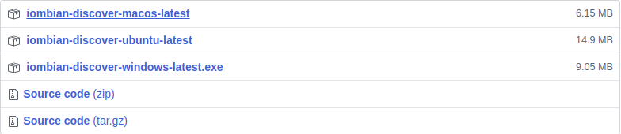
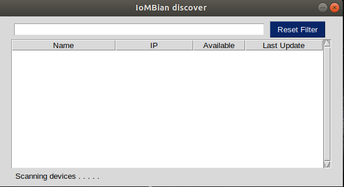
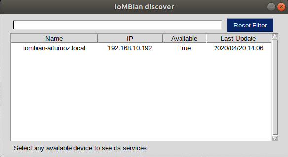
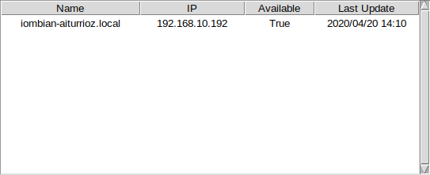
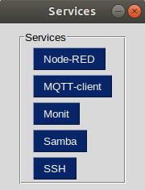

# IoMBian Discover

This is a companion app for the [IoMBian project](https://github.com/Tknika/iombian), aimed to help discovering IoMBian devices available in the local network.

## Installation

The application does not need to be installed, because it is released as a single executable file for the three main operating systems: Windows, macOS and Linux.
New releases are published in the [Release](https://github.com/Tknika/iombian-discover/releases) section of the GitHub repository:

Download the file that corresponds to your OS and launch it (usually a double click in the icon is enough).
If the application does not start, ensure that the file has execution permissions.

## Usage

Even if the app is very ease to use, this chapter will describe its structure. 

This is the look of the app when it is launched:

The app will start to scan devices on its own, so there is no need to press any 'Scan' button.
Whenever a new device is found, it will be presented automatically.

The following image shows how does the app look like when a IoMBian device is found:

As it can be seen, the window is deviced in different sections:

### Filter section

The filter option is really useful when many IoMBian devices (> 20) are available in the local network.
The app filters the discovered devices by their names and the filter is applied in real time, as soon as any character is writen in the input box.
The 'Reset Filter' button deletes the introduced text and updates the device list.

### Devices section

This is the primary section of the application, where the discovered devices are listed.
The following information is displayed for each device:

- Name (or hostname)
- IP address
- If the device is reachable
- Last time the device changed its status

Clicking on any device will show the [services section](#services-section).

### Messages section

The messages section will present complementary information to the user, so that he/she knows what could be done.
It will also display error messages whenever something behaves incorrectly.
It is there just to guide the user.

### Services section

This pop-up window will appear after selecting any device from the device list.
It describes the services provided by the IoMBian client and for each service a blue button is shown.
Pressing a button will redirect the user to the chosen application, making it really easy to open the required app.
Some services (Node-RED, MQTT-client and Monit) are web based, so they will be openned in the default web brower, but others (Samba and SSH) may not be available in all operating systems.

## Demo

[See it in action](https://drive.google.com/file/d/1PcJJXwQq2R9-g5VpMf3x-1BePRU6gRwT/view?usp=sharing)

Enjoy!

## Author

(c) 2020 [Tknika](https://tknika.eus/) ([Aitor Iturrioz](https://github.com/bodiroga))

Licensed under the Apache License, Version 2.0 (the "License");
you may not use this file except in compliance with the License.
You may obtain a copy of the License at

    http://www.apache.org/licenses/LICENSE-2.0

Unless required by applicable law or agreed to in writing, software
distributed under the License is distributed on an "AS IS" BASIS,
WITHOUT WARRANTIES OR CONDITIONS OF ANY KIND, either express or implied.
See the License for the specific language governing permissions and
limitations under the License.
